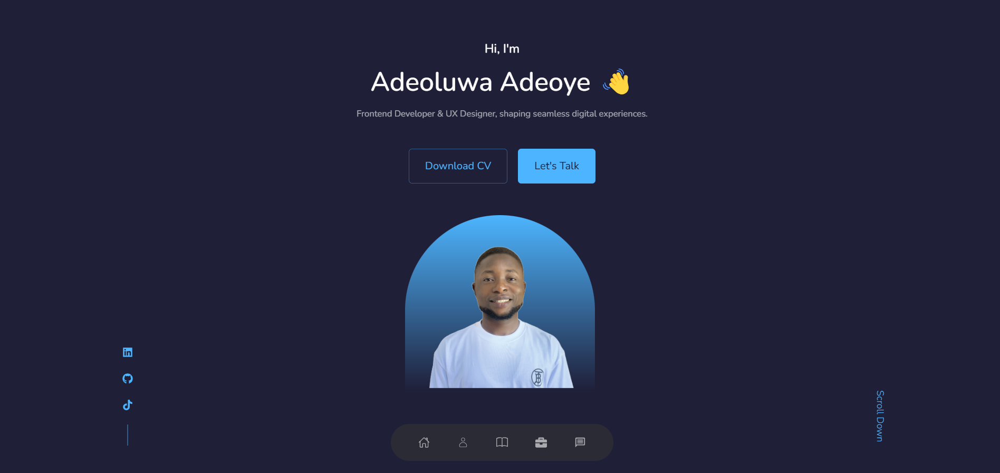

# Professional Portfolio

Welcome to my professional portfolio repository!

## Portfolio Links

- **Live Site:** [Visit Website](https://adeoluwaadeoye.netlify.app/)
- **GitHub Repository:** [View on GitHub](https://github.com/adeoluwaadeoye/adeoluwa/)

## Overview

This repository hosts the source code for my professional portfolio website. It serves as a comprehensive showcase of my skills, projects, and experiences in Front-End Development. The portfolio is meticulously crafted to provide visitors with insights into my expertise, work history, and accomplishments.

## Key Features

- **Homepage:** Introduces visitors to my professional background and career objectives.
- **Projects:** Presents a curated selection of my most notable projects with detailed descriptions and live links.
- **Skills:** Highlights my technical competencies, including programming languages, frameworks, and tools.
- **Resume:** Offers a downloadable version of my resume for further exploration.
- **Contact Form:** Provides a user-friendly interface for visitors to reach out and connect with me.

## Technologies Used

- HTML5
- CSS3 (with Sass for preprocessing)
- JavaScript (with ES6+ features)
- jQuery (for DOM manipulation)
- Git (for version control)

## Getting Started

To view the portfolio locally on your machine, follow these steps:

1. Clone the repository: `git clone https://github.com/adeoluwaadeoye/adeoluwa.git`
2. Navigate to the project directory: `cd adeoluwa`
3. Open `index.html` in your preferred web browser.

## Demo Images

## License

This project is licensed under the MIT License - see the [LICENSE](LICENSE) file for details.

## Contact

For inquiries or collaborations, feel free to reach out to me at adeoluadeoye7@gmail.com
